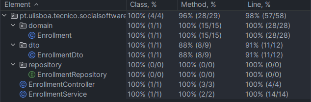
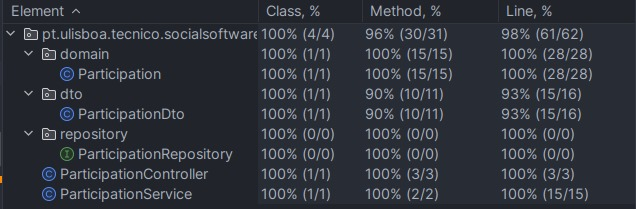
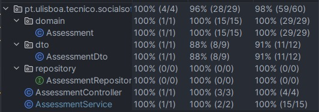

# ES P1 submission, Group 38

## Feature Activity Enrollment

### Subgroup
- Fábio Mata, 102802, [GitLab link](https://gitlab.rnl.tecnico.ulisboa.pt/ist1102802)
    + Issues assigned: [#3](https://gitlab.rnl.tecnico.ulisboa.pt/es/es24-38/-/issues/3),
      [#5](https://gitlab.rnl.tecnico.ulisboa.pt/es/es24-38/-/issues/5),
      [#6](https://gitlab.rnl.tecnico.ulisboa.pt/es/es24-38/-/issues/6),
      [#7](https://gitlab.rnl.tecnico.ulisboa.pt/es/es24-38/-/issues/7),
      [#10](https://gitlab.rnl.tecnico.ulisboa.pt/es/es24-38/-/issues/10),
      [#12](https://gitlab.rnl.tecnico.ulisboa.pt/es/es24-38/-/issues/12),
      [#41](https://gitlab.rnl.tecnico.ulisboa.pt/es/es24-38/-/issues/41),
      [#55](https://gitlab.rnl.tecnico.ulisboa.pt/es/es24-38/-/issues/55),
      [#58](https://gitlab.rnl.tecnico.ulisboa.pt/es/es24-38/-/issues/58),
      [#68](https://gitlab.rnl.tecnico.ulisboa.pt/es/es24-38/-/issues/68),
      [#69](https://gitlab.rnl.tecnico.ulisboa.pt/es/es24-38/-/issues/69),
      [#73](https://gitlab.rnl.tecnico.ulisboa.pt/es/es24-38/-/issues/73)
- Nuno Gonçalves, 103392, [GitLab link](https://gitlab.rnl.tecnico.ulisboa.pt/ist1103392)
    + Issues assigned: [#4](https://gitlab.rnl.tecnico.ulisboa.pt/es/es24-38/-/issues/4),
      [#8](https://gitlab.rnl.tecnico.ulisboa.pt/es/es24-38/-/issues/8),
      [#9](https://gitlab.rnl.tecnico.ulisboa.pt/es/es24-38/-/issues/9),
      [#11](https://gitlab.rnl.tecnico.ulisboa.pt/es/es24-38/-/issues/11),
      [#12](https://gitlab.rnl.tecnico.ulisboa.pt/es/es24-38/-/issues/12),
      [#13](https://gitlab.rnl.tecnico.ulisboa.pt/es/es24-38/-/issues/13),
      [#14](https://gitlab.rnl.tecnico.ulisboa.pt/es/es24-38/-/issues/14),
      [#15](https://gitlab.rnl.tecnico.ulisboa.pt/es/es24-38/-/issues/15),
      [#55](https://gitlab.rnl.tecnico.ulisboa.pt/es/es24-38/-/issues/55),
      [#56](https://gitlab.rnl.tecnico.ulisboa.pt/es/es24-38/-/issues/56),
      [#57](https://gitlab.rnl.tecnico.ulisboa.pt/es/es24-38/-/issues/57),
      [#71](https://gitlab.rnl.tecnico.ulisboa.pt/es/es24-38/-/issues/71),
      [#72](https://gitlab.rnl.tecnico.ulisboa.pt/es/es24-38/-/issues/72),
      [#78](https://gitlab.rnl.tecnico.ulisboa.pt/es/es24-38/-/issues/78),
      [#83](https://gitlab.rnl.tecnico.ulisboa.pt/es/es24-38/-/issues/83),
      [#88](https://gitlab.rnl.tecnico.ulisboa.pt/es/es24-38/-/issues/88)

### Merge requests associated with this feature

The list of pull requests associated with this feature is:

- [MR #1](https://gitlab.rnl.tecnico.ulisboa.pt/es/es24-38/-/merge_requests/1)
- [MR #3](https://gitlab.rnl.tecnico.ulisboa.pt/es/es24-38/-/merge_requests/3)

### Test Coverage Screenshot

The reason for the enrollmentDto coverage not being 100% is that the `toString` method is not used,
but we decided to keep it there for consistency with the other DTOs.

The screenshot includes the test coverage results associated with the new/changed entities:

---

## Feature Participant Selection

### Subgroup
 - Pedro Sousa, ist1102664, [GitLab link](https://gitlab.rnl.tecnico.ulisboa.pt/ist1102664)
   + Issues assigned: 
    [#16](https://gitlab.rnl.tecnico.ulisboa.pt/es/es24-38/-/issues/16),
    [#17](https://gitlab.rnl.tecnico.ulisboa.pt/es/es24-38/-/issues/17),
    [#18](https://gitlab.rnl.tecnico.ulisboa.pt/es/es24-38/-/issues/18),
    [#19](https://gitlab.rnl.tecnico.ulisboa.pt/es/es24-38/-/issues/19),
    [#20](https://gitlab.rnl.tecnico.ulisboa.pt/es/es24-38/-/issues/20), 
    [#21](https://gitlab.rnl.tecnico.ulisboa.pt/es/es24-38/-/issues/21), 
    [#23](https://gitlab.rnl.tecnico.ulisboa.pt/es/es24-38/-/issues/23), 
    [#24](https://gitlab.rnl.tecnico.ulisboa.pt/es/es24-38/-/issues/24), 
    [#61](https://gitlab.rnl.tecnico.ulisboa.pt/es/es24-38/-/issues/61), 
    [#62](https://gitlab.rnl.tecnico.ulisboa.pt/es/es24-38/-/issues/62), 
    [#74](https://gitlab.rnl.tecnico.ulisboa.pt/es/es24-38/-/issues/74), 
    [#76](https://gitlab.rnl.tecnico.ulisboa.pt/es/es24-38/-/issues/76), 
    [#87](https://gitlab.rnl.tecnico.ulisboa.pt/es/es24-38/-/issues/87), 
    [#90](https://gitlab.rnl.tecnico.ulisboa.pt/es/es24-38/-/issues/90), 
    [#91](https://gitlab.rnl.tecnico.ulisboa.pt/es/es24-38/-/issues/91), 
    [#92](https://gitlab.rnl.tecnico.ulisboa.pt/es/es24-38/-/issues/92)
 - Francisco Fonseca, ist1102492, [GitLab link](https://gitlab.rnl.tecnico.ulisboa.pt/ist1102492)
   + Issues assigned: 
   [#16](https://gitlab.rnl.tecnico.ulisboa.pt/es/es24-38/-/issues/16), 
   [#17](https://gitlab.rnl.tecnico.ulisboa.pt/es/es24-38/-/issues/17), 
   [#22](https://gitlab.rnl.tecnico.ulisboa.pt/es/es24-38/-/issues/22), 
   [#25](https://gitlab.rnl.tecnico.ulisboa.pt/es/es24-38/-/issues/25), 
   [#26](https://gitlab.rnl.tecnico.ulisboa.pt/es/es24-38/-/issues/26), 
   [#59](https://gitlab.rnl.tecnico.ulisboa.pt/es/es24-38/-/issues/59), 
   [#60](https://gitlab.rnl.tecnico.ulisboa.pt/es/es24-38/-/issues/60), 
   [#79](https://gitlab.rnl.tecnico.ulisboa.pt/es/es24-38/-/issues/79), 
   [#80](https://gitlab.rnl.tecnico.ulisboa.pt/es/es24-38/-/issues/80), 
   [#86](https://gitlab.rnl.tecnico.ulisboa.pt/es/es24-38/-/issues/86), 
   [#93](https://gitlab.rnl.tecnico.ulisboa.pt/es/es24-38/-/issues/93)
 
### Merge requests associated with this feature

The list of pull requests associated with this feature is:

 - [MR #2](https://gitlab.rnl.tecnico.ulisboa.pt/es/es24-38/-/merge_requests/2) (closed due to duplicated commits)
 - [MR #5](https://gitlab.rnl.tecnico.ulisboa.pt/es/es24-38/-/merge_requests/5) (new version of MR #2)
 - [MR #7](https://gitlab.rnl.tecnico.ulisboa.pt/es/es24-38/-/merge_requests/7)
 - [MR #11](https://gitlab.rnl.tecnico.ulisboa.pt/es/es24-38/-/merge_requests/11)

### Test Coverage Screenshot

The screenshot includes the test coverage results associated with the new/changed entities:

---

## Feature Institution Assessment

### Subgroup
- João Gouveia, 102611, [GitLab link](https://gitlab.rnl.tecnico.ulisboa.pt/ist1102611)
    + Issues assigned: 
    [#27](https://gitlab.rnl.tecnico.ulisboa.pt/es/es24-38/-/issues/27),
    [#42](https://gitlab.rnl.tecnico.ulisboa.pt/es/es24-38/-/issues/42),
    [#43](https://gitlab.rnl.tecnico.ulisboa.pt/es/es24-38/-/issues/43),
    [#44](https://gitlab.rnl.tecnico.ulisboa.pt/es/es24-38/-/issues/44),
    [#45](https://gitlab.rnl.tecnico.ulisboa.pt/es/es24-38/-/issues/45),
    [#46](https://gitlab.rnl.tecnico.ulisboa.pt/es/es24-38/-/issues/46),
    [#47](https://gitlab.rnl.tecnico.ulisboa.pt/es/es24-38/-/issues/47),
    [#48](https://gitlab.rnl.tecnico.ulisboa.pt/es/es24-38/-/issues/48),
    [#49](https://gitlab.rnl.tecnico.ulisboa.pt/es/es24-38/-/issues/49),
    [#50](https://gitlab.rnl.tecnico.ulisboa.pt/es/es24-38/-/issues/50),
    [#51](https://gitlab.rnl.tecnico.ulisboa.pt/es/es24-38/-/issues/51),
    [#52](https://gitlab.rnl.tecnico.ulisboa.pt/es/es24-38/-/issues/52),
    [#53](https://gitlab.rnl.tecnico.ulisboa.pt/es/es24-38/-/issues/53),
    [#54](https://gitlab.rnl.tecnico.ulisboa.pt/es/es24-38/-/issues/54),
    [#63](https://gitlab.rnl.tecnico.ulisboa.pt/es/es24-38/-/issues/63),
    [#64](https://gitlab.rnl.tecnico.ulisboa.pt/es/es24-38/-/issues/64),
    [#65](https://gitlab.rnl.tecnico.ulisboa.pt/es/es24-38/-/issues/65),
    [#77](https://gitlab.rnl.tecnico.ulisboa.pt/es/es24-38/-/issues/77),
    [#81](https://gitlab.rnl.tecnico.ulisboa.pt/es/es24-38/-/issues/81),
    [#82](https://gitlab.rnl.tecnico.ulisboa.pt/es/es24-38/-/issues/82),
    [#89](https://gitlab.rnl.tecnico.ulisboa.pt/es/es24-38/-/issues/89),
    [#98](https://gitlab.rnl.tecnico.ulisboa.pt/es/es24-38/-/issues/98),
    [#99](https://gitlab.rnl.tecnico.ulisboa.pt/es/es24-38/-/issues/99),
    [#100](https://gitlab.rnl.tecnico.ulisboa.pt/es/es24-38/-/issues/100),
    [#101](https://gitlab.rnl.tecnico.ulisboa.pt/es/es24-38/-/issues/101),
    [#104](https://gitlab.rnl.tecnico.ulisboa.pt/es/es24-38/-/issues/104),
    [#107](https://gitlab.rnl.tecnico.ulisboa.pt/es/es24-38/-/issues/107),
    [#108](https://gitlab.rnl.tecnico.ulisboa.pt/es/es24-38/-/issues/108),
    [#109](https://gitlab.rnl.tecnico.ulisboa.pt/es/es24-38/-/issues/109)
- Gonçalo Rua, 102604, [GitLab link](https://gitlab.rnl.tecnico.ulisboa.pt/ist1102604)
    + Issues assigned:
    [#27](https://gitlab.rnl.tecnico.ulisboa.pt/es/es24-38/-/issues/27),
    [#28](https://gitlab.rnl.tecnico.ulisboa.pt/es/es24-38/-/issues/28),
    [#29](https://gitlab.rnl.tecnico.ulisboa.pt/es/es24-38/-/issues/29),
    [#30](https://gitlab.rnl.tecnico.ulisboa.pt/es/es24-38/-/issues/30),
    [#31](https://gitlab.rnl.tecnico.ulisboa.pt/es/es24-38/-/issues/31),
    [#32](https://gitlab.rnl.tecnico.ulisboa.pt/es/es24-38/-/issues/32),
    [#33](https://gitlab.rnl.tecnico.ulisboa.pt/es/es24-38/-/issues/33),
    [#34](https://gitlab.rnl.tecnico.ulisboa.pt/es/es24-38/-/issues/34),
    [#35](https://gitlab.rnl.tecnico.ulisboa.pt/es/es24-38/-/issues/35),
    [#36](https://gitlab.rnl.tecnico.ulisboa.pt/es/es24-38/-/issues/36),
    [#37](https://gitlab.rnl.tecnico.ulisboa.pt/es/es24-38/-/issues/37),
    [#38](https://gitlab.rnl.tecnico.ulisboa.pt/es/es24-38/-/issues/38),
    [#39](https://gitlab.rnl.tecnico.ulisboa.pt/es/es24-38/-/issues/39),
    [#40](https://gitlab.rnl.tecnico.ulisboa.pt/es/es24-38/-/issues/40),
    [#42](https://gitlab.rnl.tecnico.ulisboa.pt/es/es24-38/-/issues/42),
    [#66](https://gitlab.rnl.tecnico.ulisboa.pt/es/es24-38/-/issues/66),
    [#67](https://gitlab.rnl.tecnico.ulisboa.pt/es/es24-38/-/issues/67),
    [#70](https://gitlab.rnl.tecnico.ulisboa.pt/es/es24-38/-/issues/70),
    [#84](https://gitlab.rnl.tecnico.ulisboa.pt/es/es24-38/-/issues/84),
    [#85](https://gitlab.rnl.tecnico.ulisboa.pt/es/es24-38/-/issues/85),
    [#94](https://gitlab.rnl.tecnico.ulisboa.pt/es/es24-38/-/issues/94),
    [#95](https://gitlab.rnl.tecnico.ulisboa.pt/es/es24-38/-/issues/95),
    [#96](https://gitlab.rnl.tecnico.ulisboa.pt/es/es24-38/-/issues/96),
    [#97](https://gitlab.rnl.tecnico.ulisboa.pt/es/es24-38/-/issues/97),
    [#103](https://gitlab.rnl.tecnico.ulisboa.pt/es/es24-38/-/issues/103),
    [#105](https://gitlab.rnl.tecnico.ulisboa.pt/es/es24-38/-/issues/105),
    [#106](https://gitlab.rnl.tecnico.ulisboa.pt/es/es24-38/-/issues/106),
    [#109](https://gitlab.rnl.tecnico.ulisboa.pt/es/es24-38/-/issues/109)

### Merge requests associated with this feature

The list of pull requests associated with this feature is:

- [MR #4](https://gitlab.rnl.tecnico.ulisboa.pt/es/es24-38/-/merge_requests/4) (closed due to duplicated commits)
- [MR #6](https://gitlab.rnl.tecnico.ulisboa.pt/es/es24-38/-/merge_requests/6) (new version of MR #4)
- [MR #8](https://gitlab.rnl.tecnico.ulisboa.pt/es/es24-38/-/merge_requests/8)
- [MR #9](https://gitlab.rnl.tecnico.ulisboa.pt/es/es24-38/-/merge_requests/9)

### Test Coverage Screenshot

The screenshot includes the test coverage results associated with the new/changed entities:

---
